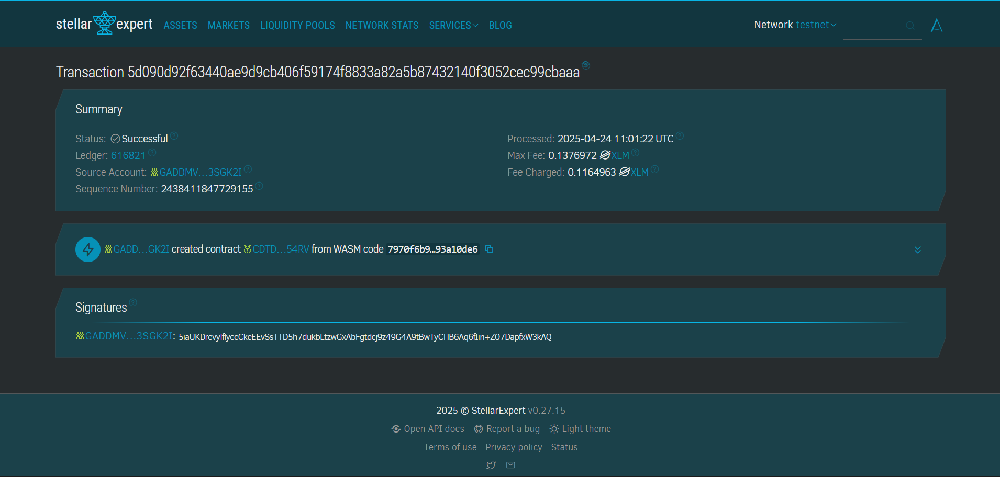

# Digital Marketplace for Crafters

## Project Description
A decentralized application (dApp) built on the Stellar Soroban platform that empowers local artisans and crafters to list, showcase, and manage their handmade products on-chain.

## Project Vision
To create a trustless, transparent, and open digital marketplace where artists can sell directly to customers without intermediaries. By utilizing smart contracts, the platform ensures ownership, transparency in transactions, and efficient inventory handling for crafters worldwide.

## Key Features
- **Product Listing**: Crafters can add new handmade products including title, description, and price.
- **On-chain Storage**: All product data is securely stored on-chain using Soroban’s instance storage.
- **Retrieve Product Info**: Buyers and sellers can fetch product details by product ID.
- **Product Count Tracker**: Keeps track of total products listed on the platform.

## Future Scope
- **Purchase Flow with Escrow**: Add purchasing mechanism with escrow and dispute resolution.
- **User Authentication**: Tie products to crafter accounts using Stellar addresses.
- **Rating and Reviews**: Enable buyers to rate products and crafters.
- **NFT Integration**: Convert listings to NFTs for provenance and ownership tracking.
- **Multi-language Support**: Enhance accessibility for global crafters and customers.

---

Built using [Soroban SDK](https://soroban.stellar.org/docs) – a smart contract platform for the Stellar blockchain.
